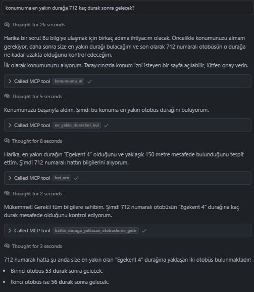
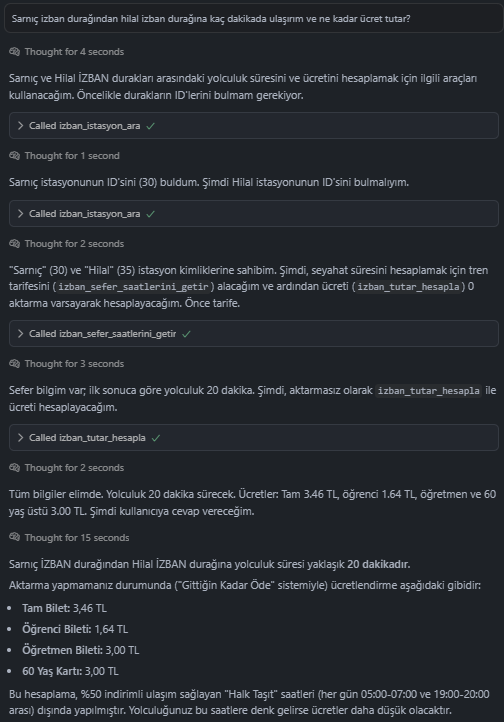

# İzmir Ulaşım MCP Sunucusu

İzmir toplu taşıma verilerine erişim sağlayan bir Model Bağlam Protokolü (MCP) sunucusu, AI asistanlarının şehir ulaşım verilerini ve analizlerini sorgulamasına olanak tanır.

## Genel Bakış

Bu MCP sunucusu, İzmir'in [Açık Veri Portalındaki](https://acikveri.bizizmir.com/tr/dataset?organization=eshot) ESHOT veritabanına bağlanır ve anlık otobüs konumlarını, durak bilgilerini, hat güzergahlarını, sefer saatlerini ve yaklaşan araç verilerini almak için çeşitli araçlar sunar. Sunucu, durağa yaklaşan otobüsleri getirme, hat üzerindeki anlık otobüs konumlarını sorgulama, belirli hat ve durak kombinasyonları için yaklaşan araçları filtreleme, durak arama, hat arama ve sefer saatlerini sorgulama gibi işlevler sağlar. Claude Desktop ve Cursor gibi MCP uyumlu AI asistanlarıyla veya agentic yapılarla çalışmak üzere tasarlanmıştır ve [Açık Veri Portalındaki](https://acikveri.bizizmir.com/tr/dataset?organization=eshot) anlık ve canlı ESHOT (şimdilik sadece ESHOT) verileriyle ilgili doğal dil sorguları yapmanızı sağlar.

## Özellikler ve Araçlar

Bu MCP sunucusu, aşağıdaki araçları (tool) içermektedir:

* **`duraga_yaklasan_otobusleri_getir(stop_id)`**: Belirtilen bir durak ID'sine yaklaşmakta olan tüm otobüslerin bilgilerini getirir.
* **`hattin_anlik_otobus_konumlarini_getir(line_id)`**: ID'si girilen bir hatta ait tüm otobüslerin anlık konum bilgilerini getirir.
* **`hattin_duraga_yaklasan_otobuslerini_getir(line_id, stop_id)`**: Belirtilen bir hattın, belirtilen durağa yaklaşmakta olan otobüslerini getirir.
* **`durak_ara(durak_adi)`**: Adında belirtilen metin geçen otobüs duraklarını arar.
* **`izban_istasyon_ara(istasyon_adi)`**: Adında belirtilen metin geçen İZBAN istasyonlarını arar.
* **`izban_sefer_saatlerini_getir(kalkis_istasyon_id, varis_istasyon_id)`**: Belirtilen iki İZBAN istasyonu arasındaki sefer saatlerini getirir.
* **`izban_tutar_hesapla(binis_istasyon_id, inis_istasyon_id, aktarma_sayisi)`**: 'Gittiğin Kadar Öde' sistemine göre İZBAN yolculuk ücretini hesaplar.
* **`hat_ara(hat_bilgisi)`**: Adında veya güzergahında belirtilen metin geçen otobüs hatlarını arar.
* **`hat_sefer_saatlerini_ara(hat_no)`**: Belirtilen hat numarasına göre otobüs sefer saatlerini arar.
* **`hat_guzergah_koordinatlarini_getir(hat_no)`**: Belirtilen hat numarasına ait güzergahın koordinat (enlem/boylam) bilgilerini getirir.
* **`hat_detaylarini_ara(hat_bilgisi)`**: Adında veya güzergahında belirtilen metni içeren hatların çalışma saatleri gibi detaylı bilgilerini arar.
* **`en_yakin_duraklari_bul(latitude, longitude, tur)`**: Verilen enlem ve boylama en yakın otobüs duraklarını veya İZBAN istasyonlarını bulur.
* **`konumumu_al()`**: Tarayıcı üzerinden kullanıcının hassas coğrafi konumunu alır.
* **`metro_istasyonlarini_getir()`**: İzmir metrosuna ait tüm istasyonların bir listesini döndürür.
* **`metro_sefer_saatlerini_getir()`**: İzmir metrosuna ait tüm sefer saatlerini getirir.
* **`metro_istasyonlari_arasi_mesafe_hesapla(kalkis_istasyon_adi, varis_istasyon_adi)`**: İki metro istasyonu arasındaki mesafeyi metre cinsinden hesaplar.
* **`tramvay_hatlarini_getir()`**: İzmir tramvayına ait tüm hatların bir listesini döndürür.
* **`tramvay_istasyonlarini_getir(hat_id)`**: Belirtilen hat ID'sine sahip tramvay hattının tüm istasyonlarını getirir.
* **`tramvay_seferlerini_getir(hat_id)`**: Belirtilen hat ID'sine göre tramvay sefer saatlerini getirir.
* **`karsiyaka_tram_duraklar_arasi_mesafe_hesapla(kalkis_istasyon_adi, varis_istasyon_adi)`**: İki Karşıyaka tramvay istasyonu arasındaki mesafeyi metre cinsinden hesaplar.
* **`konak_tram_1_duraklar_arasi_mesafe_hesapla(kalkis_istasyon_adi, varis_istasyon_adi)`**: Kara tarafı olan yöndeki iki Konak tramvay durağı arasındaki mesafeyi metre cinsinden hesaplar.
* **`konak_tram_2_duraklar_arasi_mesafe_hesapla(kalkis_istasyon_adi, varis_istasyon_adi)`**: Deniz tarafı olan yöndeki iki Konak tramvay durağı arasındaki mesafeyi metre cinsinden hesaplar.
* **`cigli_tram_duraklar_arasi_mesafe_hesapla(kalkis_istasyon_adi, varis_istasyon_adi)`**: İki Çiğli tramvay durağı arasındaki mesafeyi metre cinsinden hesaplar.

## Kurulum ve Kullanım

### Gereksinimler

* Python 3.11+
* `requests`
* `mcp-cli` 
* `fastmcp` 
* `pandas`
* `numpy`
* `flask`
* `pyarrow`
* `fastparquet`

### Kurulum
1.  **Projeyi klonlayın veya indirin:**
    ```bash
    git clone https://github.com/ogulcanakca/izmir-ulasim-mcp.git
    cd izmir-ulasim-mcp
    ```

2.  **Gerekli kütüphaneleri yükleyin:**
3.  
    ```bash
    uv sync
    ```
    pip ile yüklemek isterseniz:
    ```bash
    pip install -r requirements.txt
    ```

### MCP Client Configuration
Sunucuyu Claude Desktop ile kullanmak için:

- **macOS**: `~/Library/Application Support/Claude/claude_desktop_config.json`
- **Windows**: `%APPDATA%\Claude\claude_desktop_config.json`

Cursor'da kullanmak için:

- **macOS**: `$HOME/.cursor/mcp.json`
- **Windows**: `%USERPROFILE%\.cursor\mcp.json`

```json
{
  "mcpServers": {
      "izmir_ulasim": {
      "command": "python",
      "args": ["path\\to\\izmir_ulasim_main.py"]
  }
  }
}
```
veya npm ile oluşturmak isterseniz:
```json
{
  "mcpServers": {
    "izmir_ulasim_npm": {
    "command": "npx",
    "args": ["-y", "izmir-ulasim-mcp"]
  }
  }
}
```

## Örnek Kullanım

<p align="center">
  
  <br>
  
  <br>
  
</p>

## Gelecek Çalışmaları

Bu proje, İzmir'in ulaşım verilerini daha erişilebilir kılmak için bir başlangıç noktasıdır. Gelecekte eklenmesi planlanan ve topluluk tarafından katkı sağlanabilecek bazı özellikler şunlardır:

### 1. Mevcut Araçların Geliştirilmesi
- **Tahmini Varış Süresi (ETA) Hesaplama:** Kalan durak sayısını, otobüsün anlık hızını veya ortalama durak arası seyahat süresini kullanarak durağa varış için tahmini bir süre (dakika cinsinden) hesaplamak.
- **Akıllı Filtreleme:** Araçlara `engelli_uygunlugu_olsun=True` veya `bisiklet_aparati_olsun=True` gibi parametreler ekleyerek daha detaylı ve ihtiyaca yönelik sorgular yapılmasını sağlamak.
- **Harita Üzerinde Görselleştirme:** Anlık konum veya güzergah sorguları için, çıktıda doğrudan bir harita servisinin (Google Maps, OpenStreetMap vb.) linkini veya statik bir harita görselini oluşturmak.

### 2. Yeni Araçlar ve Entegrasyonlar
- **Diğer Ulaşım Türleri:** ESHOT'a ek olarak, İzmir'deki diğer toplu taşıma ağları olan **İzban, Metro ve Vapur (İzdeniz)** için de benzer araçlar geliştirerek sunucuyu tam kapsamlı bir "İzmir Ulaşım" aracına dönüştürmek.
- **Yol Tarifi ve Rota Planlama:** Kullanıcının "A noktasından B noktasına nasıl giderim?" sorusuna yanıt verebilecek, en uygun (direkt veya aktarmalı) rotayı öneren gelişmiş bir araç eklemek.
- **Servis Duyuruları:** İlgili kurumların anlık arıza, gecikme veya güzergah değişikliği duyurularını sorgulayacak bir araç entegre etmek.

### 3. Kullanıcı Deneyimi ve Zeka
- **Kişiselleştirme ve Hafıza:** Asistanın, kullanıcının sık kullandığı "ev", "iş" gibi konumları veya favori hatlarını öğrenerek daha kişisel yanıtlar vermesini sağlamak.
